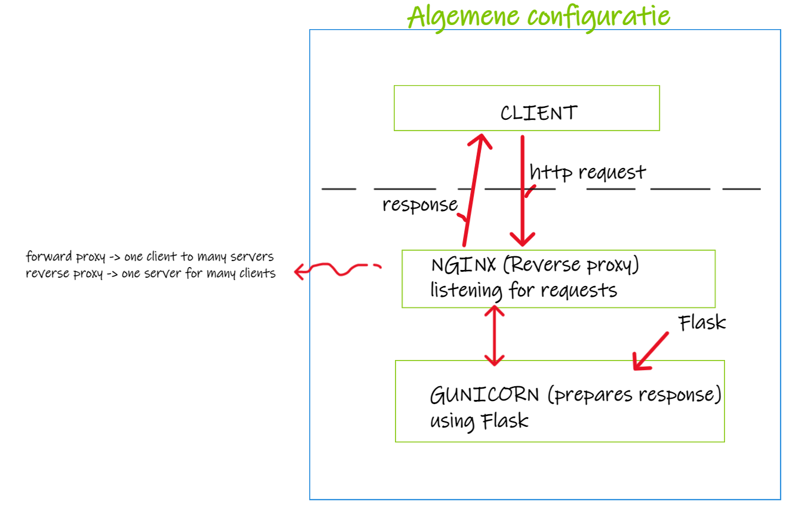

# CD Continuous Delivery

## Three components

### Digital Ocean / The server site

Mainly it was importent for me to discover the content and working of de remote server. How Flask, Nginx, Gunicorn are related and what they do. It helped me understand to put it in a diagram. Gunicorn does the listening. Gunicorn is the interface between webserver and the web-application. It needs Flask to decide what to respond with the incomming request by reading it's defenitions.

## Three 'problems'

### Deploying React app

First I wanted to deploy a React-app as we learned to create in the FED course. Not knowing alot about deploying and creating a build from the react-app this seemed somehow complicated and decided to return to the Flask application. In time I found out that workflow actions can be very usefull by creating and deploying React-builds. So this wil be the next project.

### Mulitple jobs

Most of the time during this assignment was learning and discovering. Every hour you learn new thing. Impossible to apply all at once. For example the multiple jobs in a workflow. I read some articles and saw some tutorials but could not get it to work. The syntax of the yml file is very precise and it turned out that there was still a -name 'command' without a run or uses following. Because there was so much I changed and altered (eager to put everything in the file I found on the web) that it took me hours to find out. Very nice and usefull to exploit all the possibilities!

### SSH

There is a lot of good informatie to find about github actions. But is was again aegerness that brought me in trouble mixing up al the keys or copy paste half the key that leaves you debugging till you almost want to give up!
